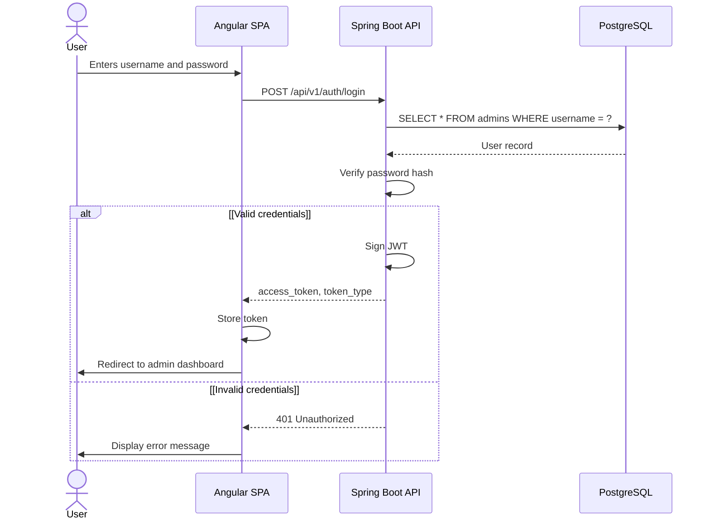
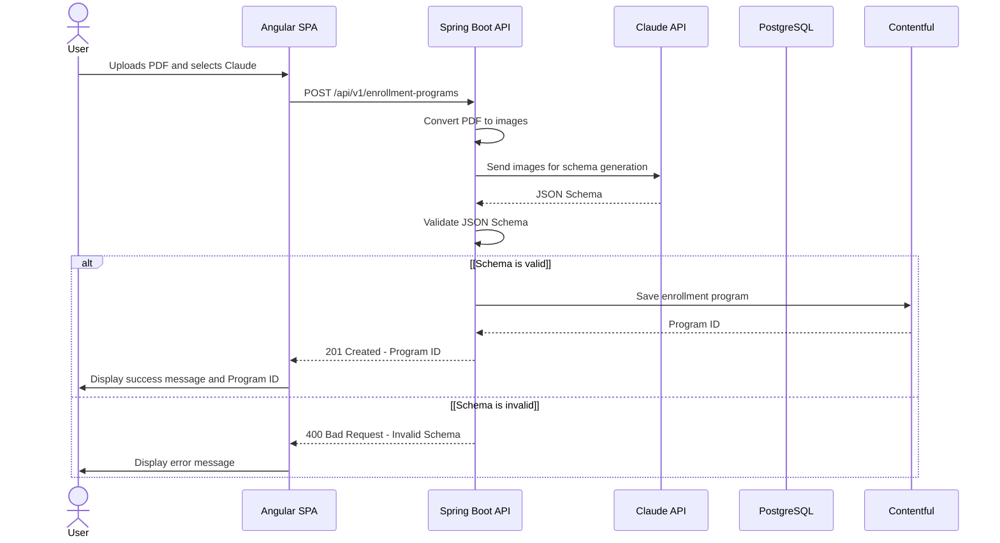
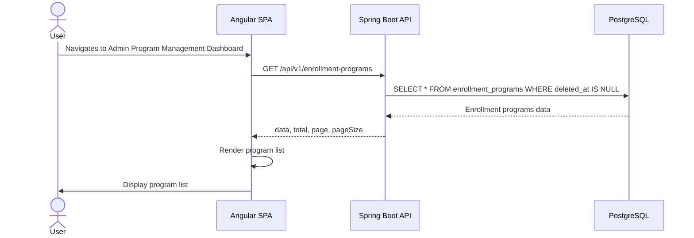
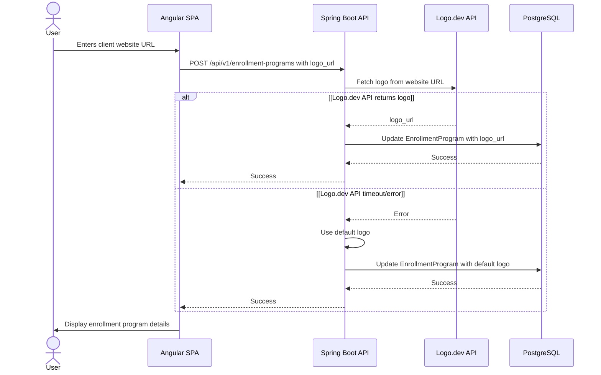

Project: DEP Multi-Tenant

## Sequence Diagrams
**Generated from:** API Contract · Data Model · Architecture Overview

```mermaid
sequenceDiagram
    actor User
    participant Angular SPA
    participant Spring Boot API
    participant PostgreSQL

    User->>Angular SPA: Enters username and password
    Angular SPA->>Spring Boot API: POST /api/v1/auth/login
    Spring Boot API->>PostgreSQL: SELECT * FROM admins WHERE username = ?
    PostgreSQL-->>Spring Boot API: User record
    Spring Boot API->>Spring Boot API: Verify password hash
    alt [Valid credentials]
        Spring Boot API->>Spring Boot API: Sign JWT
        Spring Boot API-->>Angular SPA: access_token, token_type
        Angular SPA->>Angular SPA: Store token
        Angular SPA->>User: Redirect to admin dashboard
    else [Invalid credentials]
        Spring Boot API-->>Angular SPA: 401 Unauthorized
        Angular SPA->>User: Display error message
    end
```

```mermaid
sequenceDiagram
    actor User
    participant Angular SPA
    participant Spring Boot API
    participant Claude API
    participant PostgreSQL
    participant Contentful

    User->>Angular SPA: Uploads PDF and selects Claude
    Angular SPA->>Spring Boot API: POST /api/v1/enrollment-programs
    Spring Boot API->>Spring Boot API: Convert PDF to images
    Spring Boot API->>Claude API: Send images for schema generation
    Claude API-->>Spring Boot API: JSON Schema
    Spring Boot API->>Spring Boot API: Validate JSON Schema
    alt [Schema is valid]
        Spring Boot API->>Contentful: Save enrollment program
        Contentful-->>Spring Boot API: Program ID
        Spring Boot API-->>Angular SPA: 201 Created - Program ID
        Angular SPA->>User: Display success message and Program ID
    else [Schema is invalid]
        Spring Boot API-->>Angular SPA: 400 Bad Request - Invalid Schema
        Angular SPA->>User: Display error message
    end
```

```mermaid
sequenceDiagram
    actor User
    participant Angular SPA
    participant Spring Boot API
    participant PostgreSQL

    User->>Angular SPA: Navigates to Admin Program Management Dashboard
    Angular SPA->>Spring Boot API: GET /api/v1/enrollment-programs
    Spring Boot API->>PostgreSQL: SELECT * FROM enrollment_programs WHERE deleted_at IS NULL
    PostgreSQL-->>Spring Boot API: Enrollment programs data
    Spring Boot API-->>Angular SPA: data, total, page, pageSize
    Angular SPA->>Angular SPA: Render program list
    Angular SPA->>User: Display program list
```

```mermaid
sequenceDiagram
    actor User
    participant Angular SPA
    participant Spring Boot API
    participant Logo.dev API

    User->>Angular SPA: Enters client website URL
    Angular SPA->>Spring Boot API: POST /api/v1/enrollment-programs with logo_url
    Spring Boot API->>Logo.dev API: Fetch logo from website URL
    alt [Logo.dev API returns logo]
        Logo.dev API-->>Spring Boot API: logo_url
        Spring Boot API->>PostgreSQL: Update EnrollmentProgram with logo_url
        PostgreSQL-->>Spring Boot API: Success
        Spring Boot API-->>Angular SPA: Success
    else [Logo.dev API timeout/error]
        Logo.dev API-->>Spring Boot API: Error
        Spring Boot API->>Spring Boot API: Use default logo
        Spring Boot API->>PostgreSQL: Update EnrollmentProgram with default logo
        PostgreSQL-->>Spring Boot API: Success
        Spring Boot API-->>Angular SPA: Success
    end
    Angular SPA->>User: Display enrollment program details
```